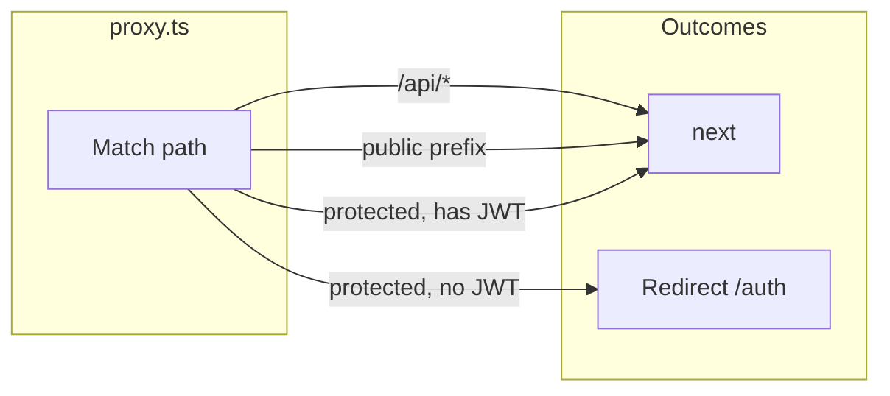
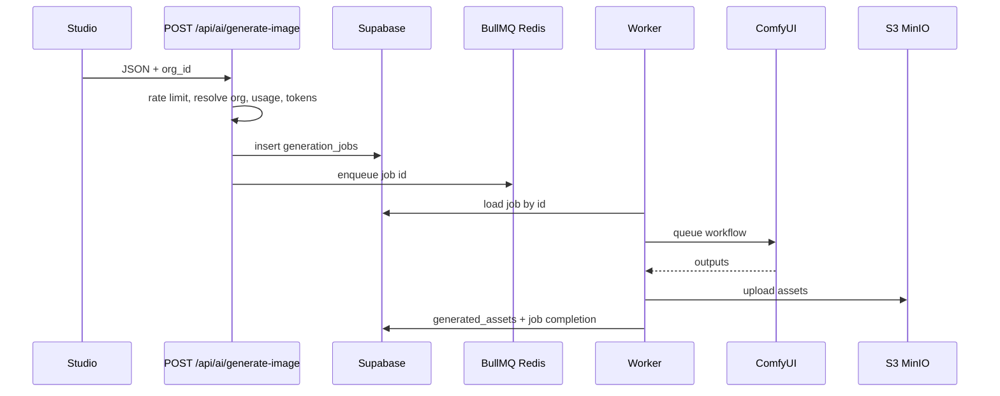

# Application flow (canonical)

Broader onboarding (topology, file map, traps): [AGENT_HANDOFF.md](./AGENT_HANDOFF.md).

Single source of truth for how requests, auth, org context, generation, and local infra fit together. When code diverges, update **either** this doc **or** the implementation—ideally both.

## 1. Edge: `src/proxy.ts` (Next “Proxy”)

- Runs **before** matched routes. **Does not** implement business logic; only pass-through vs redirect.
- **All** paths under `/api/*` are **passed through** with **no** JWT redirect. APIs enforce auth via `getServerSession` (or equivalent) and return JSON status codes.
- **Public** page/API prefixes (non-exhaustive; see `PUBLIC_PREFIXES` in code): `/`, `/landing`, `/auth`, `/api/auth/*`, `/api/waitlist`, `/api/health`, `/api/stripe/webhook`, plus static/`_next` handling via matcher exclusions.
- **Protected pages** (e.g. `/studio`, `/generations/*`): if there is **no** valid NextAuth JWT, **307** to `/auth?callbackUrl=<path>`.

## 2. Root layout shell

Order matters for providers:

1. `SessionProvider` (NextAuth)
2. `OrganizationProvider` — loads org list when `authenticated`, resolves **active org** from `localStorage` key `nexus_active_org_id` or first org
3. Page `children`

`html` and `body` use `suppressHydrationWarning` to tolerate **browser extensions** that inject attributes (e.g. on `body`). That does **not** fix app-level hydration bugs; those must be fixed in components.

## 3. Studio: generation UI + persistence

- **`GenerationProvider`** (`src/context/GenerationContext.tsx`): initial React state is **always** `defaultGenerationSettings` on server **and** on the client’s first render. Saved UI is read from `localStorage` (`generationSettings`) in a **`useEffect`** after mount, then written back when `loaded` and settings change. This avoids **SSR/client mismatch** from reading `localStorage` in a `useState` initializer.
- **`GenerationPanel`** sends **`org_id`** with `POST /api/ai/generate-image` and refetches **`GET /api/billing/me?org_id=...`** when the selected org changes.

## 4. Org resolution (server)

Implemented in `src/lib/api/org.ts` and consumers (e.g. `generate-image`, billing):

| Input | Behavior |
|--------|----------|
| `org_id` or `orgId` in body/query | Must be an **active** `organization_members` row for the session user; else **403**. |
| Omitted | **First** active membership (`getPrimaryOrgId`) for legacy clients. |

`stripGenerationRequestMeta` removes `org_id` / `orgId` from persisted **`input_params`** so Comfy/job JSON stays clean.

## 5. Image generation pipeline

- **Worker** uses **`job.org_id`** from the row for storage keys and **`generated_assets.org_id`**. No separate “primary org” in the worker.

## 6. Billing read path

- **`GET /api/billing/me`**: optional **`?org_id=`**. If present, same **membership** check as generation; forbidden org → **403** and structured **`billing_failure`** log with **`requestedOrgId`** (query value, not a resolved tenant). If omitted, uses primary org; if none, returns starter-shaped defaults.

## 7. Local Docker hybrid (see also `docker-stack.md`)

| Piece | Notes |
|--------|--------|
| Supabase | Schema + auth; not started by default compose |
| Redis | Compose publishes **6380 → 6379**; in-network services use `redis://redis:6379`; host **`pnpm dev`** uses `REDIS_URL=redis://127.0.0.1:6380` |
| MinIO | API **9000**, console **9001** |
| ComfyUI | From containers: default `host.docker.internal:8188`; optional `--profile gpu` |

## Quick truth table

| Question | Answer |
|----------|--------|
| Does proxy redirect unauthenticated `/api/*`? | **No.** |
| Where is active org enforced for jobs? | **API** resolve + **`generation_jobs.org_id`**; worker follows row. |
| Why hydrate generation settings in `useEffect`? | **Same** initial HTML as server; **avoid** hydration errors when `localStorage` differs from defaults. |
